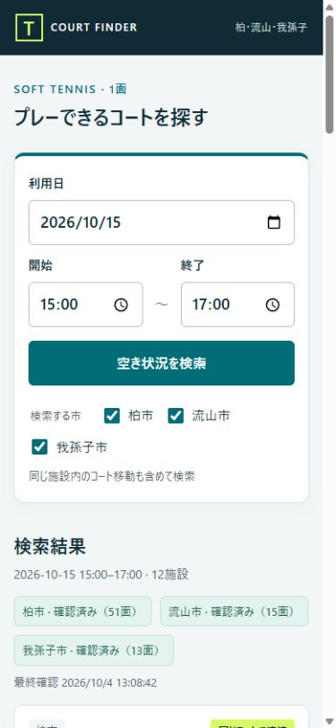
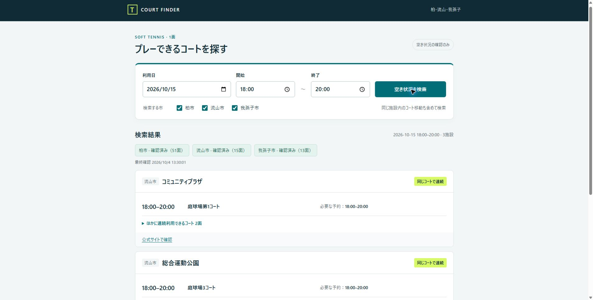

# 検証記録

検証日: 2026年10月4日（日本時間）

## 実データ

2026年10月15日のソフトテニス対象をログインせずに取得しました。施設一覧は固定登録せず、各市のソフトテニス検索結果から列挙しています。

| 市 | この日の取得面数 | 結果 |
| --- | ---: | --- |
| 柏市 | 51 | 全対象の取得成功 |
| 流山市 | 15 | 全対象の取得成功 |
| 我孫子市 | 13 | 全対象の取得成功 |

3市合計79面。直近の照会では約9秒で完了しました。通信や公式サイトの混雑により所要時間は変わります。面数は検証時点の検索結果で、将来固定とは限りません。

ブラウザーで2026年10月15日15:00〜17:00、3市すべてを検索し、12施設の候補を確認しました。柏の葉庭球場1面の15:00〜17:00の空き表示を公式画面でも確認しました。

18:00〜20:00の検索では、富勢運動場の必要な予約が17:00〜21:00と表示されることを確認しました。流山市の10:00〜12:00の検索では、総合運動公園で10:00〜11:00は9コート、11:00〜12:00は6コートという移動候補を確認しました。

## 判定テスト

`python -m unittest discover -s tests -v`: 8件成功。

- 同じコートの連続利用を移動より優先
- 同じ施設内でコートを移動し、隙間なく利用
- 時間に隙間があれば候補にしない
- 別施設の空きを組み合わせない
- 希望時間を含む予約枠へ拡張
- 連続利用できる他のコートを列挙
- 我孫子市の1予約3時間以内への分割
- 予約済みの枠を候補にしない

`node --check public/app.js`: 成功。

## 画面

幅390px、高さ844pxのブラウザー表示で検索を実行しました。横方向のはみ出しがないこと、検索フォームと結果が表示されること、ブラウザーのエラーログがないことを確認しています。実機のiPhone/Androidでの検証は未実施です。

## 公開環境

2026年10月4日13:28にRenderの無料プラン、Singaporeリージョンで初回デプロイが成功しました。Python 3.12.8、lxml 6.1.3で稼働しています。

- 公開URL: https://tennis-court-finder.onrender.com/
- GitHub: https://github.com/omi03x9/tennis-court-finder
- 2026年10月15日18:00〜20:00、全3市の検索が公開環境で成功（79面、3施設の候補）。最終確認時刻13:30:01。
- GitHubに保存した機能コードは、ローカルで検証した内容と一致しています（改行形式を除く）。
- 公開画面を390px幅で確認し、横方向のはみ出しがないことを確認しました。
- 公開画面のブラウザーエラーログは0件でした。

実機のiPhone/Androidでの操作は未検証です。公式サイトの変更や混雑による将来の取得可否を保証するものではありません。

## 2026-10-04 Vercel移行

- 公開URL: https://m2tio-court-finder.vercel.app/
- 無料Hobbyプランで公開。GitHubアプリはOnly select repositories、tennis-court-finderの1件に保存・再読み込み確認済み。
- 初期日付は日本時間の当日、初期時刻19:00〜21:00、タイトルM2TIO COURT FINDER。
- 既存のプラン判定8テスト成功。Vercel用handlerをHTTP経由で実行し3市・79面を確認。
- ログインしていないブラウザーから2026-10-15 19:00〜21:00を検索。柏51面、流山15面、我孫子13面すべて確認済み、3施設の候補を表示。初回検索の約15秒後に完了を確認。
- スマホ幅390pxで表示と横はみ出しを確認。実機iPhone/Androidは未検証。
- Render版にもタイトルと初期時刻を反映し、公開画面で確認済み。
